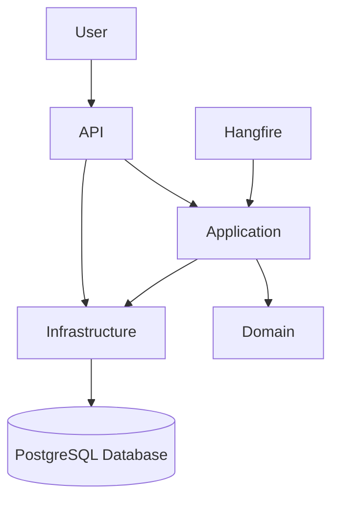

# API de Monitoramento de Desperdício de Alimentos

## Visão Geral do Projeto

Este projeto implementa uma API RESTful para monitorar e gerenciar o desperdício de alimentos, com foco em restaurantes, mercados e residências. A solução visa reduzir o impacto ambiental, econômico e na segurança alimentar, fornecendo ferramentas para cadastrar, consultar e notificar sobre alimentos próximos do vencimento, além de gerar relatórios de impacto.

A arquitetura foi projetada com princípios de Clean Architecture, SOLID e DDD leve, garantindo um código limpo, testável, manutenível e escalável.

## Problema Abordado

O desperdício de alimentos é um problema global significativo. Toneladas de comida ainda em bom estado são descartadas diariamente, resultando em:
*   **Impacto Ambiental:** Contribuição para aterros sanitários, emissão de gases de efeito estufa e uso ineficiente de recursos naturais (água, terra, energia).
*   **Impacto Econômico:** Perdas financeiras para produtores, distribuidores e consumidores.
*   **Segurança Alimentar:** Contradição entre o desperdício e a fome global.

## Solução Proposta

Uma API robusta que oferece as seguintes funcionalidades:
*   **Cadastro de Alimentos:** Permite registrar alimentos com data de validade e localização.
*   **Consulta por Vencimento:** Consulta de alimentos próximos do vencimento, com potencial para integração futura com geolocalização.
*   **Notificações Automáticas:** Geração de alertas para itens a vencer, utilizando um sistema de agendamento de tarefas.
*   **Relatórios de Impacto:** Métricas sobre o reaproveitamento versus descarte de alimentos (com dados simulados para demonstração).

## Stack Tecnológica

*   **Backend:** .NET 8 (ASP.NET Core Web API)
*   **Banco de Dados:** PostgreSQL
*   **ORM:** Entity Framework Core
*   **Mapeamento:** AutoMapper
*   **Validação:** FluentValidation
*   **Agendamento de Tarefas:** Hangfire
*   **Autenticação:** JWT (JSON Web Tokens)
*   **Documentação API:** Swagger/OpenAPI

## Arquitetura

O projeto segue os princípios da **Clean Architecture**, dividindo o sistema em camadas bem definidas para garantir separação de preocupações, testabilidade e manutenibilidade.

### Diagrama de Arquitetura (Simplificado)



### Camadas

1.  **Domain (DisperdicioAlimentos.Domain):**
    *   Contém as entidades de negócio (`FoodItem`), value objects e regras de negócio.
    *   É a camada mais interna e não possui dependências de outras camadas do projeto.
    *   **Princípios SOLID:** Foco em Single Responsibility Principle (SRP) e Open/Closed Principle (OCP).
    *   **DDD Leve:** Entidades como `FoodItem` representam o core do domínio.

2.  **Application (DisperdicioAlimentos.Application):**
    *   Define a lógica de negócio específica da aplicação.
    *   Contém interfaces para repositórios (`IFoodItemRepository`) e serviços de aplicação (`IFoodItemService`).
    *   Implementa DTOs (`FoodItemDto`) para transferência de dados e validadores (`FoodItemDtoValidator`) usando FluentValidation.
    *   Depende da camada Domain.
    *   **AutoMapper:** Utilizado para mapear DTOs para entidades e vice-versa, reduzindo o código boilerplate.

3.  **Infrastructure (DisperdicioAlimentos.Infrastructure):**
    *   Implementa as interfaces definidas na camada Application.
    *   Contém a lógica de persistência de dados (Entity Framework Core com PostgreSQL), implementações de repositórios (`FoodItemRepository`) e o `ApplicationDbContext`.
    *   Gerencia a configuração do banco de dados e migrações.
    *   Depende das camadas Application e Domain.

4.  **API (DisperdicioAlimentos.API):**
    *   Ponto de entrada da aplicação.
    *   Contém os controladores (`FoodItemsController`) que expõem os endpoints RESTful.
    *   Configura a injeção de dependência, middleware (autenticação, tratamento de exceções), Swagger e Hangfire.
    *   Depende das camadas Application e Infrastructure.

## Boas Práticas e Padrões de Projeto

*   **Clean Architecture:** Separação clara de responsabilidades, facilitando a manutenção e a evolução do sistema.
*   **SOLID Principles:**
    *   **SRP (Single Responsibility Principle):** Cada classe/módulo tem uma única razão para mudar (ex: `FoodItem` para domínio, `FoodItemService` para lógica de aplicação, `FoodItemRepository` para persistência).
    *   **OCP (Open/Closed Principle):** Aberto para extensão, fechado para modificação (ex: novas implementações de repositório podem ser adicionadas sem alterar a camada Application).
    *   **LSP (Liskov Substitution Principle):** Interfaces e implementações garantem que subtipos são substituíveis por seus tipos base.
    *   **ISP (Interface Segregation Principle):** Interfaces pequenas e específicas (ex: `IFoodItemRepository` focado apenas em operações de `FoodItem`).
    *   **DIP (Dependency Inversion Principle):** Módulos de alto nível não dependem de módulos de baixo nível. Ambos dependem de abstrações (ex: `FoodItemService` depende de `IFoodItemRepository`, não de `FoodItemRepository`).
*   **Injeção de Dependência (DI):** Gerenciada pelo contêiner de DI do ASP.NET Core, promovendo acoplamento fraco.
*   **Mapeamento de Objetos (AutoMapper):** Reduz a complexidade e o boilerplate no mapeamento entre DTOs e entidades.
*   **Validação de Entrada (FluentValidation):** Garante a integridade dos dados de entrada de forma declarativa e extensível.
*   **Tratamento Global de Exceções:** Middleware customizado para padronizar as respostas de erro da API, melhorando a experiência do desenvolvedor e do consumidor da API.
*   **Segurança (JWT):** Autenticação baseada em tokens para proteger os endpoints da API.
*   **Tarefas em Segundo Plano (Hangfire):** Demonstra a capacidade de lidar com processos assíncronos e agendados, como notificações de vencimento.

## Trade-offs e Decisões de Design

*   **Entity Framework Core como Unit of Work:** O `DbContext` do EF Core atua como uma implementação do padrão Unit of Work. Embora uma interface `IUnitOfWork` explícita pudesse ser adicionada, optou-se por usar o comportamento padrão do EF Core para manter a simplicidade e evitar abstrações desnecessárias que apenas envolveriam `SaveChanges()`.
*   **Localização como `string`:** A propriedade `Location` na entidade `FoodItem` é atualmente uma `string`. Para um projeto mais complexo, poderia ser um Value Object com coordenadas geográficas e lógica de proximidade. Para este MVP, a `string` é suficiente e pode ser estendida no futuro.
*   **Autenticação Simples:** A autenticação JWT foi implementada de forma básica. Em um cenário de produção, seria necessário integrar com um sistema de gerenciamento de usuários (ex: Identity Server, Azure AD B2C) e implementar autorização baseada em roles/claims.
*   **Notificações Hangfire:** O Hangfire está configurado para verificar itens a vencer diariamente. Em um sistema de produção, a frequência e o mecanismo de notificação (e-mail, push, etc.) seriam mais sofisticados e configuráveis.

## Ideias para Futuras Melhorias

*   **Geolocalização Avançada:** Implementar a propriedade `Location` como um Value Object com coordenadas (latitude, longitude) e usar extensões do PostgreSQL (ex: PostGIS) para consultas de proximidade.
*   **Sistema de Notificações:** Expandir o Hangfire para enviar notificações reais (e-mail, SMS) quando os alimentos estiverem próximos do vencimento.
*   **Gerenciamento de Usuários e Roles:** Integrar ASP.NET Core Identity ou um provedor de identidade externo para um gerenciamento de usuários e autorização mais robusto.
*   **Relatórios Dinâmicos:** Desenvolver uma camada de relatórios mais sofisticada, talvez com ferramentas de BI ou dashboards customizados.
*   **Cache:** Implementar caching (ex: Redis) para dados frequentemente acessados, melhorando a performance.
*   **Logging Estruturado:** Integrar Serilog para logging estruturado e centralizado (ex: ELK Stack).
*   **Testes:** Adicionar testes unitários, de integração e de aceitação para todas as camadas.
*   **Contêineres:** Dockerizar a aplicação e o banco de dados para facilitar o deploy e o desenvolvimento.

## Como Executar o Projeto

### 1. Clonar o Repositório

Primeiro, clone o repositório para sua máquina local:

```bash
git clone [URL_DO_SEU_REPOSITORIO]
cd disperdicio-alimentos
```
**Nota:** Substitua `[URL_DO_SEU_REPOSITORIO]` pela URL real do seu repositório Git.

### 2. Pré-requisitos

*   [.NET 8 SDK](https://dotnet.microsoft.com/download/dotnet/8.0)
*   [PostgreSQL](https://www.postgresql.org/download/) (com um servidor rodando localmente ou acessível)
*   Um editor de código como [Visual Studio Code](https://code.visualstudio.com/)

### 3. Instalação e Build Inicial

Após clonar o repositório e navegar para o diretório raiz do projeto, execute os seguintes comandos para restaurar as dependências e compilar o projeto:

```bash
dotnet restore
dotnet build
```

### 4. Configuração do Banco de Dados

1.  **Instale o PostgreSQL** e certifique-se de que ele esteja em execução.
2.  **Crie um banco de dados** chamado `DisperdicioAlimentosDb`.
3.  **Atualize a string de conexão** no arquivo `DisperdicioAlimentos.API/appsettings.json` com suas credenciais do PostgreSQL:
    ```json
    "ConnectionStrings": {
      "DefaultConnection": "Host=localhost;Port=5432;Database=DisperdicioAlimentosDb;Username=postgres;Password=your_password"
    }
    ```
    Substitua `your_password` pela senha do seu usuário `postgres`.

### 5. Migrações do Entity Framework Core

Navegue até o diretório `DisperdicioAlimentos.API` no seu terminal e execute os seguintes comandos para criar e aplicar as migrações do banco de dados:

```bash
dotnet ef migrations add InitialCreate --project ../DisperdicioAlimentos.Infrastructure --startup-project .
dotnet ef database update --project ../DisperdicioAlimentos.Infrastructure --startup-project .
```

### 6. Executando a API

Navegue até o diretório raiz do projeto (`d:/codex/0-studies/disperdicio-alimentos`) no seu terminal e execute:

```bash
dotnet run --project DisperdicioAlimentos.API
```

A API será iniciada, geralmente em `https://localhost:7000` (ou uma porta similar).

### 7. Acessando o Swagger UI

Após iniciar a API, abra seu navegador e acesse a URL do Swagger UI:

`https://localhost:7000/swagger` (ou a porta correspondente)

Você poderá ver a documentação da API e interagir com os endpoints.

### 8. Acessando o Hangfire Dashboard

O dashboard do Hangfire estará disponível em:

`https://localhost:7000/hangfire` (ou a porta correspondente)

Aqui você pode monitorar as tarefas em segundo plano agendadas.

## Contribuição

Sinta-se à vontade para explorar, testar e sugerir melhorias.
